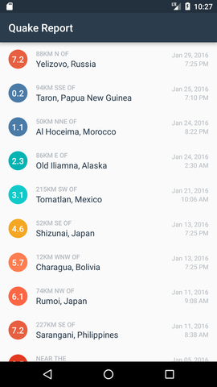
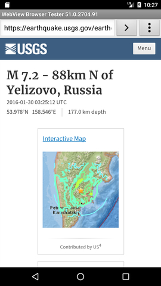

Quake Report App
===================================

This app displays a list of recent earthquakes in the world
from the U.S. Geological Survey (USGS) organization.

I have created this App in a Udacity beginner's Android course.

More info on the USGS Earthquake API available at:
https://earthquake.usgs.gov/fdsnws/event/1/

Download .apk file from here - 
https://github.com/mahajan-pooja/Quake-Report/blob/gh-pages/app-debug.apk

Pre-requisites
--------------

- Android SDK v23
- Android Build Tools v23.0.2
- Android Support Repository v23.3.0

Getting Started
---------------

This sample uses the Gradle build system. To build this project, use the
"gradlew build" command or use "Import Project" in Android Studio.

SCREENSHOTS:

